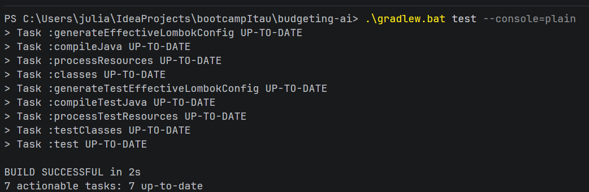
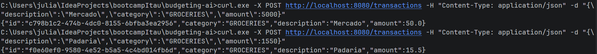
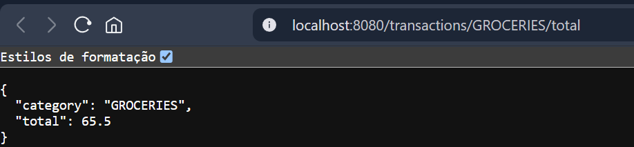
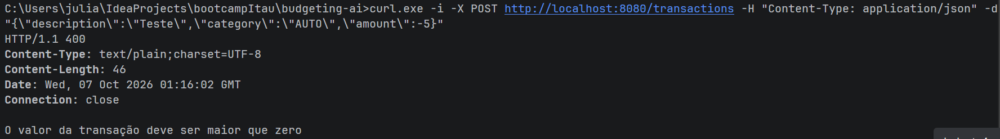

# Budgeting AI - API de orçamento com Spring AI

Projeto final do bootcamp, baseado no projeto `05-spring-ai` da trilha da DIO:
https://github.com/digitalinnovationone/dio-spring-boot-learning-track

## O que o projeto faz

É uma API de orçamento que entende comandos de voz sobre gastos. O fluxo principal é:

1. A pessoa envia um arquivo de áudio (ex.: "gastei 50 reais no mercado").
2. O áudio é transformado em texto (Whisper).
3. A IA (`ChatClient`) entende a intenção e escolhe uma função da aplicação (Tool Calling).
4. A função cria ou consulta transações no banco de dados.
5. A resposta final volta em áudio (MP3).

Também é possível usar a API só com JSON, sem IA.

## Melhorias que implementei

1. **Validação antes de salvar**: a classe `Transaction` agora recusa descrição vazia, valor menor ou igual a zero e categoria nula. Na API REST isso retorna `400 Bad Request` com a mensagem do erro.
2. **Nova tool de total por categoria**: `SumTransactionsByCategoryUseCase` soma os gastos de uma categoria. Ela é usada pela IA (ex.: "quanto gastei no mercado?") e também pelo endpoint `GET /transactions/{category}/total`.

Ajustes pequenos para rodar na minha máquina:

- Troquei o MySQL (Docker) pelo banco H2 em memória, então não precisa de Docker.
- Usei Java 21 no lugar de Java 25.
- O valor retornado agora divide os centavos por 100 (antes 5000 centavos aparecia como `5000.0`, agora aparece `50.0`).
- O teste `BudgetingApplicationTests` só roda se existir `OPENAI_API_KEY`, igual aos outros testes de integração.

## Tecnologias

- Java 21
- Spring Boot 4
- Spring AI (OpenAI: chat, transcrição com Whisper e voz com TTS)
- Spring Data JPA + H2
- Gradle
- JUnit 5 e AssertJ

## Como executar

Pré-requisito: Java 21.

A aplicação precisa da variável `OPENAI_API_KEY` para iniciar. Eu não usei uma chave real, então defini um valor fictício. Com ele, os endpoints REST funcionam normalmente, e só o endpoint de voz (`/transactions/ai`) depende de uma chave válida.

No Windows (PowerShell):

```powershell
$env:OPENAI_API_KEY="chave-ficticia"
.\gradlew.bat bootRun
```

No Linux/Mac:

```bash
export OPENAI_API_KEY="chave-ficticia"
./gradlew bootRun
```

A API sobe em `http://localhost:8080`. Os dados ficam em memória (H2) e somem quando a aplicação reinicia.

Para rodar os testes (não precisam de chave):

```bash
./gradlew test
```

Os testes de validação e de soma rodam sempre. Os testes que chamam a OpenAI só rodam se `OPENAI_API_KEY` estiver definida, então ficam ignorados.

Para usar a parte de voz de verdade, troque `chave-ficticia` por uma chave real da OpenAI.

## Como testar o fluxo principal

### Criar uma transação (valor em centavos)

```bash
curl -X POST http://localhost:8080/transactions \
  -H "Content-Type: application/json" \
  -d '{"description":"Mercado","category":"GROCERIES","amount":5000}'
```

### Listar por categoria

```bash
curl http://localhost:8080/transactions/GROCERIES
```

### Total por categoria (melhoria)

```bash
curl http://localhost:8080/transactions/GROCERIES/total
```

Resposta:

```json
{"category":"GROCERIES","total":65.5}
```

### Validação (melhoria)

```bash
curl -i -X POST http://localhost:8080/transactions \
  -H "Content-Type: application/json" \
  -d '{"description":"Teste","category":"AUTO","amount":-5}'
```

Resposta: `400` com a mensagem `O valor da transação deve ser maior que zero`.

### Fluxo com voz (precisa de chave real da OpenAI)

Não testei esta parte, porque não usei uma chave real da OpenAI para não ter custo. Esse trecho do código é o do projeto base, sem alterações minhas. Quem tiver uma chave pode testar assim:

```bash
curl -X POST http://localhost:8080/transactions/ai \
  -F "file=@src/test/resources/audio/recording-1.m4a" \
  --output resposta.mp3
```

Abra o `resposta.mp3` para ouvir a resposta. Também dá para gravar um áudio perguntando "quanto eu gastei com mercado?" para usar a nova tool de total.

O que eu testei foi a nova tool pelos endpoints REST e pelo teste unitário, que usam o mesmo caso de uso que a IA chama.

Categorias disponíveis: `GROCERIES`, `PHARMA` e `AUTO`.

## Estrutura

- `domain`: modelo (`Transaction`, `Category`) e contrato do repositório.
- `application`: casos de uso, usados tanto pelo REST quanto pela IA.
- `infrastructure`: controller HTTP e persistência JPA.

## Prints

### Testes passando


### Criando transações


### Total por categoria (melhoria)


### Validação (melhoria)


## O que aprendi

- Como o Spring AI conecta modelos de linguagem a uma aplicação Spring Boot.
- Que o `@Tool` transforma um caso de uso comum em uma função que a IA consegue chamar.
- Que a regra de negócio deve ficar no domínio: a validação na `Transaction` protege tanto o REST quanto a IA.
- Que cada camada tem uma responsabilidade (domain, application, infrastructure), e por isso a nova tool não mexeu em nada do banco.
- Como escrever testes sem depender de serviços externos, usando um repositório falso.
- Que a chave da API nunca deve ficar no código: ela vem de uma variável de ambiente, e dá para testar o resto da aplicação sem gastar nada.
