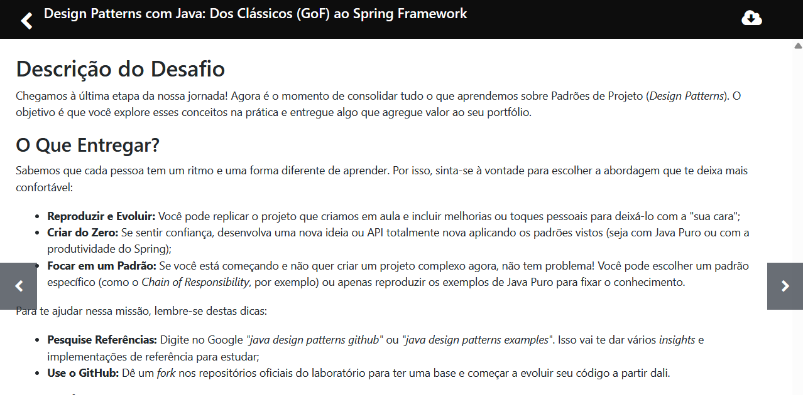

# Sistema de Pagamentos - Design Patterns com Java

Projeto final do bootcamp **Design Patterns com Java: Dos Clássicos (GoF) ao Spring Framework**.

## Desafio



O desafio pede para aplicar na prática os Padrões de Projeto aprendidos. Escolhi a opção de criar um projeto do zero, em Java puro.

## O que foi feito

Um mini sistema de pagamentos que calcula a taxa de cada forma de pagamento e avisa o cliente quando a transação é concluída.

| Padrão   | Onde                     | Para que serve                                         |
|----------|--------------------------|--------------------------------------------------------|
| Strategy | pacote `taxa`            | Cada forma de pagamento calcula sua taxa de um jeito   |
| Factory  | `CalculadoraTaxaFactory` | Escolhe a taxa certa conforme o tipo de pagamento      |
| Observer | pacote `notificacao`     | Avisa e-mail, SMS e auditoria quando há uma transação  |

Taxas: Pix 0, cartão de crédito 3% e boleto R$ 3,50 fixos.

## Estrutura

```
src/br/com/bootcamp/pagamentos
├── Main.java
├── modelo        (TipoPagamento, Transacao)
├── taxa          (Strategy + Factory)
├── notificacao   (Observer)
└── servico       (ProcessadorPagamento)
```

## Como executar

```
javac -d out -encoding UTF-8 $(find src -name "*.java")
java -cp out br.com.bootcamp.pagamentos.Main
```

Ou abra a pasta na IDE e rode a classe `Main`.

## Exemplo de saída

```
[E-MAIL] Bruno, seu pagamento via CARTAO_CREDITO de R$ 515,00 foi aprovado.
[SMS] Compra de R$ 515,00 realizada.
[AUDITORIA] cliente=Bruno tipo=CARTAO_CREDITO valor=500,00 taxa=15,00
```
